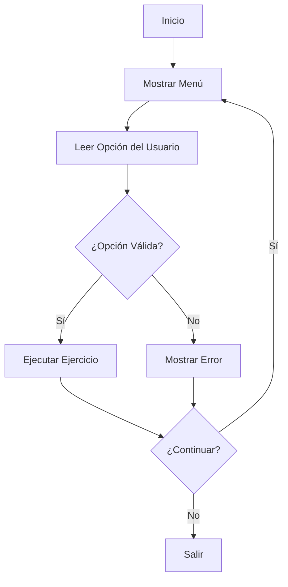
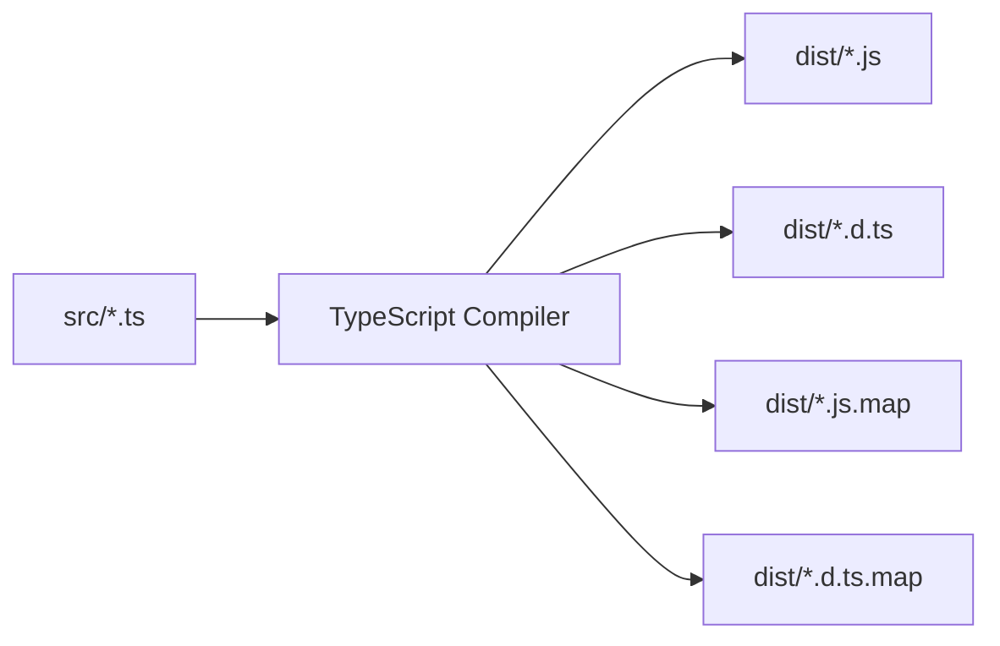

# 📁 Estructura del Proyecto

Esta página describe la organización y arquitectura del proyecto EjerTypeScript.

## 🏗️ Arquitectura General

El proyecto sigue una arquitectura modular donde cada ejercicio es una clase independiente que hereda funcionalidades comunes de la clase `ProgramUtil`.

```
📦 EjerTypeScript
├── 🎯 Punto de Entrada (index.ts)
├── 🧩 Módulos de Ejercicios (7 clases)
├── 🛠️ Utilidades Comunes (ProgramUtil)
└── 📦 Configuración y Dependencias
```

## 📂 Estructura de Directorios

```
📦 EjerTypescript/
├── 📄 package.json                    # Configuración de npm y dependencias
├── 📄 package-lock.json               # Lock file para versiones exactas
├── 📄 tsconfig.json                   # Configuración del compilador TypeScript
├── 📄 README.md                       # Documentación principal del proyecto
├── 📁 src/                            # 📁 Código fuente TypeScript
│   ├── 🎯 index.ts                    # 🎯 Punto de entrada principal
│   ├── 🎂 HowOldAreYou.ts            # 🎂 Ejercicio de validación de edad
│   ├── 🔐 ValidateStorePass.ts       # 🔐 Ejercicio de validación de contraseñas
│   ├── ➗ Divide.ts                  # ➗ Ejercicio de división
│   ├── 🔢 UnivenOrPair.ts            # 🔢 Ejercicio de números pares/impares
│   ├── 💰 AgeTaxAction.ts            # 💰 Ejercicio de cálculo de impuestos
│   ├── ➕ SumNumber.ts               # ➕ Ejercicio de suma de números
│   ├── 🔢 SumAllNum.ts               # 🔢 Ejercicio de suma acumulativa
│   └── 🛠️ ProgramUtil.ts             # 🛠️ Clase de utilidades comunes
├── 📁 dist/                           # 📁 Archivos compilados (generado automáticamente)
│   ├── 📄 *.js                       # Archivos JavaScript compilados
│   ├── 📄 *.d.ts                     # Archivos de declaración TypeScript
│   ├── 📄 *.js.map                   # Source maps para debugging
│   └── 📄 *.d.ts.map                 # Source maps para declaraciones
├── 📁 node_modules/                   # 📁 Dependencias de npm (generado automáticamente)
└── 📁 wiki-content/                   # 📁 Contenido de la wiki de GitHub
```

## 🎯 Punto de Entrada: index.ts

### 📝 Responsabilidades

- 🎮 **Gestión del menú principal**
- 🔄 **Control de flujo de la aplicación**
- 📱 **Interfaz de usuario de consola**
- 🔗 **Integración de todos los ejercicios**

### 🏗️ Estructura de la Clase Ejers

```typescript
class Ejers {
    // 📋 Mensajes estáticos del menú
    private static readonly MESSAGES: string[]
    
    // 🎯 Método principal de la aplicación
    public static main(): void
    
    // 🎮 Gestión de la interfaz de usuario
    private showMenu(): void
    
    // 🔄 Control de opciones del menú
    private handleMenuOption(option: number): void
}
```

### 🔄 Flujo de Ejecución



## 🧩 Módulos de Ejercicios

### 🎂 HowOldAreYou.ts

**Validación de edad y determinación de mayoría de edad**

```typescript
class HowOldAreYou {
    // 📊 Constantes de configuración
    private static readonly OLD_AGE: number = 18
    private static readonly ZERO: number = 0
    private static readonly MAX_AGE: number = 150
    private static readonly MESSAGES: string[]
    
    // 🔧 Propiedades de instancia
    private scanner: any
    private EXIT: boolean = true
    
    // 🎯 Métodos públicos
    public validateAge(age: number): number
    public ask(): void
    
    // 🔒 Métodos privados
    private isOld(age: number): void
}
```

### 🔐 ValidateStorePass.ts

**Sistema de validación de contraseñas**

```typescript
class ValidateStorePass {
    // 🔑 Almacenamiento de contraseñas
    private store_pass: string[]
    
    // 🎮 Control de interfaz
    private scanner: any
    private is_exit: boolean = true
    
    // 📋 Mensajes del sistema
    private static readonly MESSAJE: string[]
    
    // 🎯 Métodos públicos
    public isValidate(): void
    
    // 🔒 Métodos privados
    private validatePass(pass: string): boolean
}
```

### ➗ Divide.ts

**Calculadora de división**

```typescript
class Divide {
    // 🎮 Control de interfaz
    private scanner: any
    
    // 🎯 Método principal
    public divideAtoB(): void
    
    // 🔒 Métodos auxiliares
    private getNumber(prompt: string): Promise<number>
    private performDivision(a: number, b: number): void
}
```

### 🔢 UnivenOrPair.ts

**Determinación de números pares e impares**

```typescript
class UnivenOrPair {
    // 🎮 Control de interfaz
    private scanner: any
    
    // 🎯 Método principal
    public isPair(): void
    
    // 🔒 Métodos auxiliares
    private getNumber(): Promise<number>
    private checkParity(number: number): void
}
```

### 💰 AgeTaxAction.ts

**Cálculo de impuestos basado en edad**

```typescript
class AgeTaxAction {
    // 🎮 Control de interfaz
    private scanner: any
    
    // 🎯 Método principal
    public calTaxAction(): void
    
    // 🔒 Métodos auxiliares
    private getAge(): Promise<number>
    private getIncome(): Promise<number>
    private calculateTax(age: number, income: number): number
    private getTaxRate(age: number): number
}
```

### ➕ SumNumber.ts

**Suma de números**

```typescript
class SumNumber {
    // 🎮 Control de interfaz
    private scanner: any
    
    // 🎯 Método principal
    public cal(): void
    
    // 🔒 Métodos auxiliares
    private getNumbers(): Promise<[number, number]>
    private performSum(a: number, b: number): void
}
```

### 🔢 SumAllNum.ts

**Suma acumulativa de números**

```typescript
class SumAllNum {
    // 🎮 Control de interfaz
    private scanner: any
    
    // 🎯 Método principal
    public cal(): void
    
    // 🔒 Métodos auxiliares
    private getNumbers(): Promise<number[]>
    private calculateSum(numbers: number[]): number
}
```

## 🛠️ Clase de Utilidades: ProgramUtil.ts

### 📝 Propósito

Proporciona funcionalidades comunes para todos los ejercicios, evitando duplicación de código.

### 🏗️ Estructura

```typescript
export class ProgramUtil {
    // 🔄 Control de flujo
    public EXIT: boolean = true
    
    // 🎮 Interfaz de usuario
    public scanner: any
    
    // 📋 Mensajes del programa
    public MESSAGES: string[] = []
    
    // 🎯 Método de inicialización
    public init(...messajes: string[]): void
}
```

### 🔧 Funcionalidades

- ✅ **Configuración de readline**: Establece la interfaz de consola
- ✅ **Gestión de mensajes**: Almacena y maneja mensajes del programa
- ✅ **Control de flujo**: Permite controlar la ejecución del programa
- ✅ **Reutilización**: Evita duplicación de código entre ejercicios

## 📦 Configuración del Proyecto

### package.json

```json
{
  "name": "ejer-typescript",
  "version": "1.0.0",
  "description": "Proyecto de ejercicios con Node.js y TypeScript",
  "main": "dist/index.js",
  "scripts": {
    "build": "tsc",
    "start": "node dist/index.js",
    "dev": "ts-node src/index.ts",
    "watch": "tsc --watch",
    "clean": "rm -rf dist"
  },
  "keywords": ["typescript", "nodejs", "ejercicios"],
  "author": "",
  "license": "MIT",
  "devDependencies": {
    "@types/node": "^20.10.0",
    "ts-node": "^10.9.1",
    "typescript": "^5.3.0"
  }
}
```

### tsconfig.json

```json
{
  "compilerOptions": {
    "target": "ES2020",
    "module": "commonjs",
    "lib": ["ES2020"],
    "outDir": "./dist",
    "rootDir": "./src",
    "strict": true,
    "esModuleInterop": true,
    "skipLibCheck": true,
    "forceConsistentCasingInFileNames": true,
    "resolveJsonModule": true,
    "declaration": true,
    "declarationMap": true,
    "sourceMap": true
  }
}
```

## 🔄 Flujo de Compilación



### 📁 Archivos Generados

| Archivo | Propósito | Ejemplo |
|---------|-----------|---------|
| `*.js` | Código JavaScript ejecutable | `index.js` |
| `*.d.ts` | Declaraciones de tipos | `index.d.ts` |
| `*.js.map` | Source maps para debugging | `index.js.map` |
| `*.d.ts.map` | Source maps para declaraciones | `index.d.ts.map` |

## 🎨 Patrones de Diseño Utilizados

### 1. **Singleton Pattern**
- La clase `Ejers` maneja una única instancia del menú principal

### 2. **Template Method Pattern**
- Cada ejercicio sigue una estructura similar:
  - Inicialización
  - Entrada de datos
  - Procesamiento
  - Salida de resultados

### 3. **Strategy Pattern**
- Diferentes algoritmos para cada tipo de ejercicio
- Selección dinámica basada en la opción del menú

### 4. **Factory Pattern**
- Creación de instancias de ejercicios basada en la selección del usuario

## 🔧 Dependencias

### Dependencias de Desarrollo

| Paquete | Versión | Propósito |
|---------|---------|-----------|
| `@types/node` | ^20.10.0 | Tipos TypeScript para Node.js |
| `ts-node` | ^10.9.1 | Ejecutor de TypeScript |
| `typescript` | ^5.3.0 | Compilador de TypeScript |

### Dependencias de Runtime

El proyecto no tiene dependencias de runtime externas, solo utiliza:
- **Node.js built-ins**: `readline`, `process`
- **TypeScript runtime**: Tipos y características del lenguaje

## 📊 Métricas del Proyecto

| Métrica | Valor |
|---------|-------|
| 📁 Archivos TypeScript | 8 |
| 📝 Líneas de código | ~500 |
| 🎯 Ejercicios | 7 |
| 🔧 Clases de utilidades | 1 |
| 📦 Dependencias | 3 |
| 🎮 Interfaces de usuario | 1 (consola) |
| 🔄 Scripts npm | 5 |

---

<div align="center">

**[⬅️ Guía de Uso](Guia-de-Uso)** | **[🔧 API Reference ➡️](API-Reference)**

</div>
